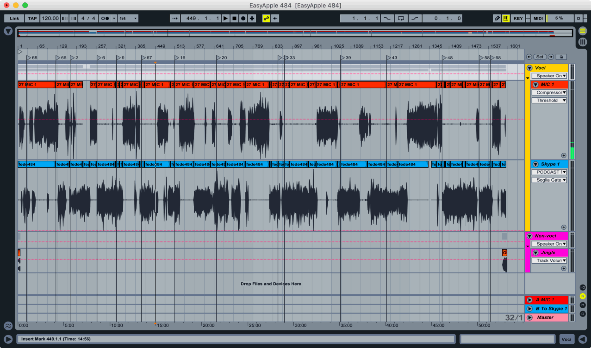

This simple web app allows the user to upload an Ableton Live `.als` project file containing markers and export them as a `.cue` file. This is helpful in order to import these markers into an app such as [Podcast Chapters](https://chaptersapp.com/).

## How to use this thing
You can either run this with Python (it requires Flask, so `pip3 install flask`)

	python3 main.py

Or you can use the `lucatnt/als2cue_web` Docker image

	docker run -p 5000:80 lucatnt/als2cue_web

Either way you will end up with a webserver running on port 5000.

## Why
I record [my podcasts](https://www.easypodcast.it/) in Ableton live, and I use Live's markers to save when we switch topics. Each topics then becomes a chapter with its own title, and I embed these titles and timestamps into the mp3 files themselves using the awesome [Podcast Chapters](https://chaptersapp.com/) Mac app.

Manually creating chapters in Podcast Chapters, however, is pretty laborious, especially given that I already have the timestamps saved as Ableton Live markers in the `.als` project file.

So I wrote a little script, `als2cue`, to extract the markers' timestamps and export them in a `.cue` files, which Podcast Chapters can read.

## How
`.als` project files are basically zipped xml files.

I examined one of them and determined that markers are saved in the `Locators` array. Each `Locator` element has a `Time` field, which determines the marker position, in "beats" (and this shows that Live is supposed to be a music production program that I'm forcing into a podcast editing app).

To convert beats into minutes and seconds, the projects's tempo has to be taken into account, and we can find its value in `Tempo > Manual > Value`.

So we have `bps = bpm / 60`, where `bps` is the number of beats per second.

From that we can easily get to the position in seconds for each marker: `seconds = beats / bps`